# SOC Lab – Networking, Traffic Analysis, and SIEM (Day 05)

Hands-on SOC project combining subnet design, Wireshark analysis, protocol troubleshooting, and ELK-based SIEM monitoring for an SSH brute-force attack.

## Lab Topology & IP Plan

The lab uses two VirtualBox networks:
- **NAT adapter** on some VMs for Internet access.
- **Host-only network** for isolated attack/monitoring traffic.

### Virtual Machines

- **ELK-SERVER**
  - Role: SIEM backend (Elasticsearch + Kibana + Fleet Server)
  - OS: Linux Mint
  - NICs:
    - Host-only: `192.168.10.129`
  - Lab subnet: `192.168.10.128/27`

- **Kali (Attacker)**
  - Role: Offensive box (Hydra, Nmap, Wireshark)
  - NICs:
    - NAT: Internet access (DHCP from VirtualBox)
    - Host-only: `192.168.10.131`
  - Used for: SSH brute-force, pings, packet captures.

- **mint-victim (Linux Mint)**
  - Role: SSH target + log source for SIEM
  - NICs:
    - NAT: optional Internet updates
    - Host-only: `192.168.10.132`
  - Services: OpenSSH on TCP 22, Elastic Agent (System + System auth).

### Host-only Lab Subnet

- Network: `192.168.10.128/27`
- Mask: `255.255.255.224`
- Used IPs:
  - `192.168.10.129` – ELK-SERVER
  - `192.168.10.131` – Kali
  - `192.168.10.132` – mint-victim

## 1. Small Office Subnet Design

Designed a /27 subnet `192.168.1.0/27` (30 usable hosts) for a 20-device office and validated connectivity with ICMP ping.

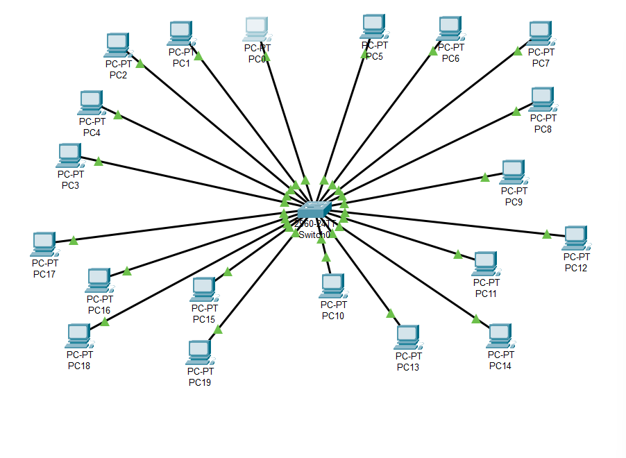

**Artifacts:**

- `report/Day05_report.pdf` – full writeup (Section 3).
- `screenshots/subnet_topology.png`
- `screenshots/pt_ping_192-168-1-10.png`

## 2. Traffic Capture and Troubleshooting

Captured host-only traffic in Wireshark, analysed protocol hierarchy and I/O graphs, then broke and fixed routing to verify troubleshooting skills.

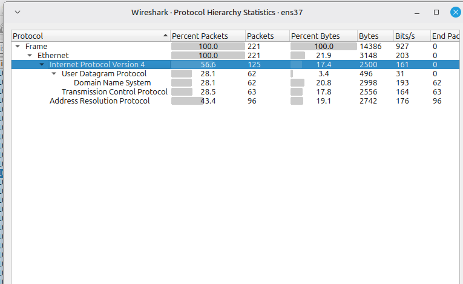

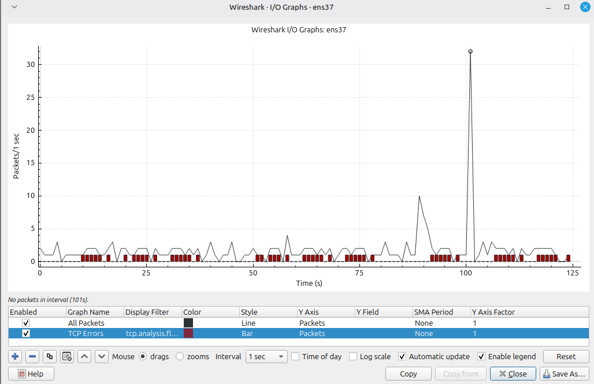

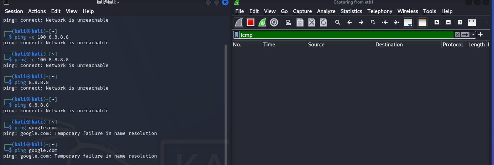

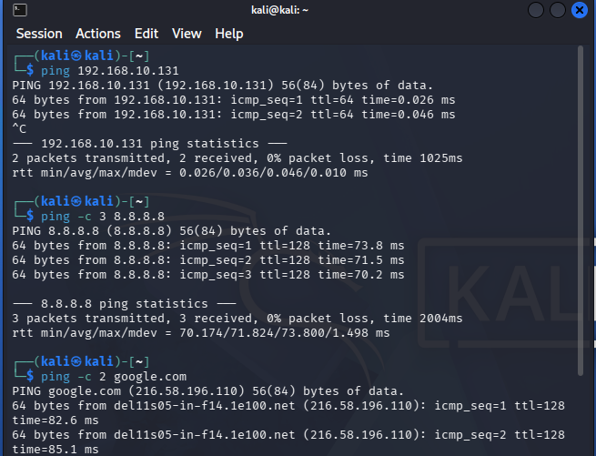

## 3. ELK SIEM Setup

Deployed Elasticsearch and Kibana on ELK-SERVER, configured Fleet policies, and started collecting system and auth logs from the Linux Mint victim.

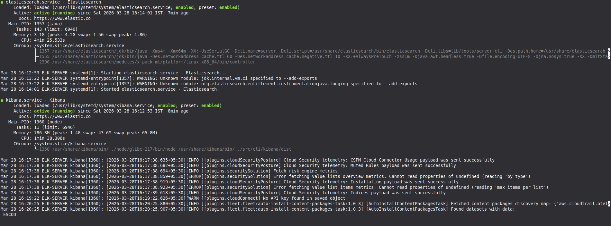

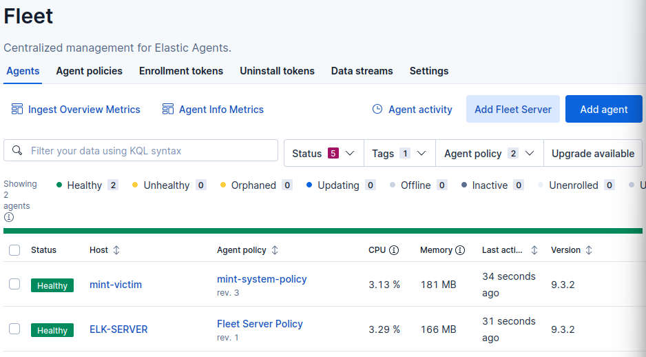

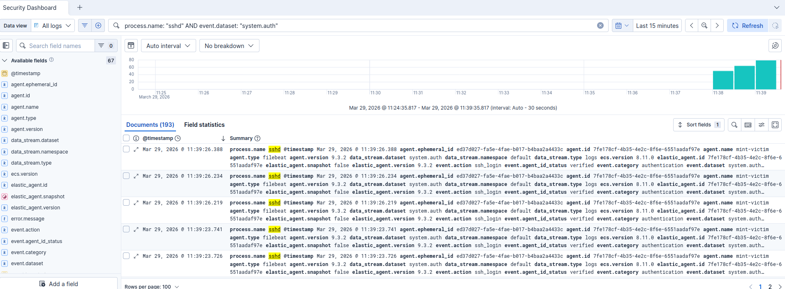

**Artifacts:**

- `screenshots/elk_services_running.png`
- `screenshots/fleet_agents.png`
- `screenshots/discover_ssh_failures.png`
- Detailed commands: `docs/elk-setup-commands.md`

## 4. SSH Brute-Force Incident & Threat Hunting

Launched Hydra brute-force from Kali (`192.168.10.131`) against SSH on `192.168.10.132`, captured SSH packets, and hunted the attack in Kibana dashboards.

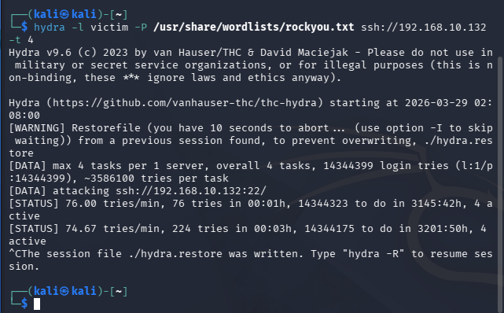

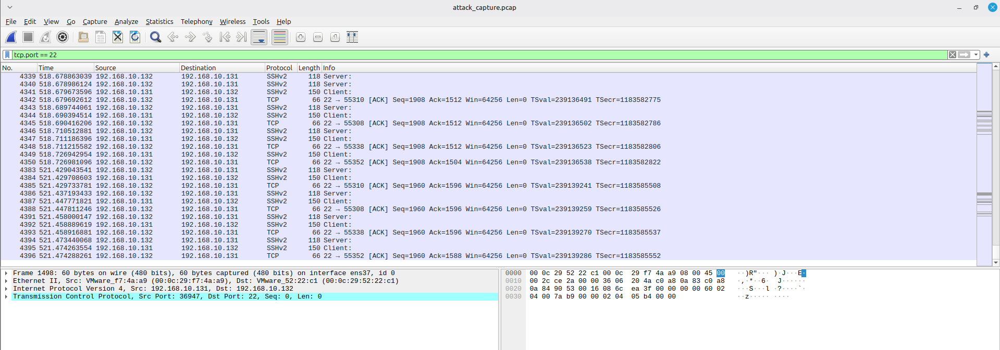

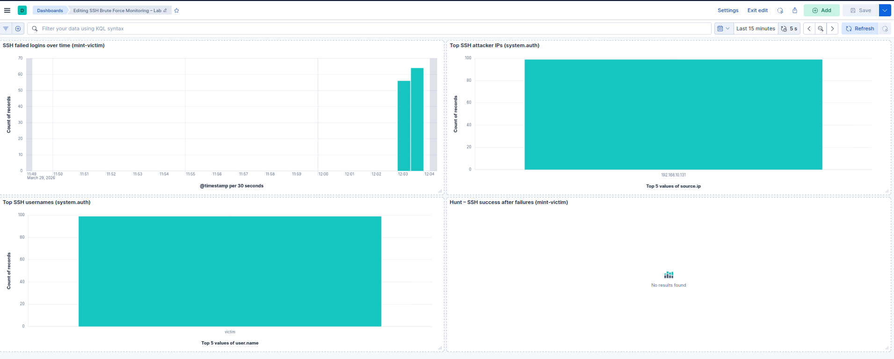

**Artifacts:**

- `screenshots/hydra_bruteforce.png`
- `screenshots/wireshark_ssh.png`
- `screenshots/kibana_dashboard.png`

## 5. Key Skills Demonstrated

- IPv4 subnetting and address planning for small offices.
- Packet-level analysis with Wireshark (hierarchy, graphs, ICMP/SSH).
- Linux routing and basic network troubleshooting.
- ELK + Fleet deployment, log ingestion, and field-based queries.
- Correlating packets and logs to investigate brute-force attacks and verify impact.